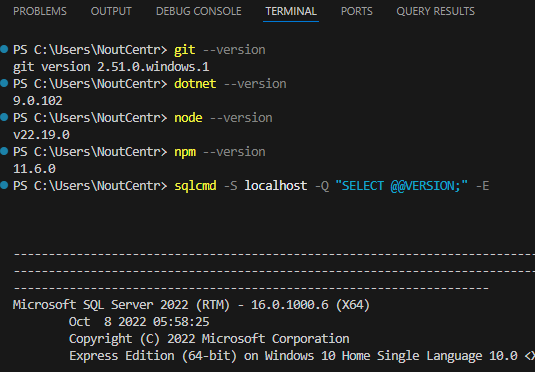
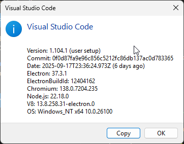
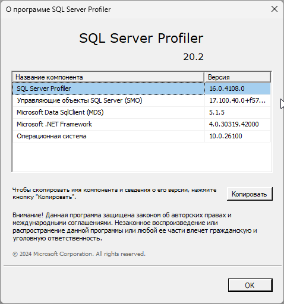
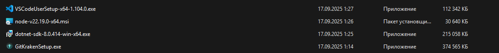

    ФИО и идентификатор:
        Терентьеввс Сергей Геннадьевич
        TerentyevSergey

    Версии установленных инструментов с выводами команд:
        Git: git --version - 2.51.0.windows.1
        .NET SDK: dotnet --version и/или dotnet --info - 9.0.102
        Node.js и npm: node --version, npm --version - v22.19.0 и 11.6.0
        VS Code: версия из "Help → About" ( https://i.vgy.me/lCSS3D.png ) - 1.104.1 
        SQL Server или SQLite: версия (по возможности команда/скриншот клиента) - Microsoft SQL Server 2022 (RTM) - 16.0.1000.6 (X64)  https://i.vgy.me/zW8kWY.png 
        
    Скриншоты подтверждений (терминал с выводом, окна установщиков, About VS Code). Добавьте их рядом, напр.: students/<id>/task_00/doc/img/... и вставьте в readme.md.
    Краткое описание, что именно установлено и где (если меняли путь/папку)
        1. Установленные версии программ
        

        2. Visual Studio Code
        

        3. SQL Server
        

        4. Процесс установки
        
        